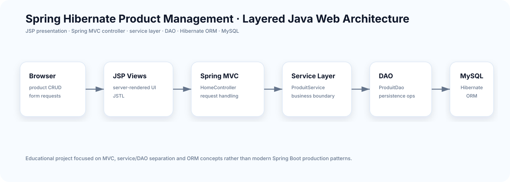

<div align="center">

# Spring Hibernate Product Management

### Classic layered Java web application for product CRUD

**Spring MVC · Hibernate ORM · JSP · MySQL · Maven · WAR deployment**


</div>

A Java web application for managing products using a classic layered architecture built with **Spring MVC, Hibernate ORM, JSP and MySQL**.

The project is kept as an educational example of MVC/service/DAO separation and ORM fundamentals.

## Architecture



```text
Browser → JSP → Spring MVC Controller → Service → DAO → Hibernate → MySQL
```

## Layer responsibilities

| Layer | Main component | Responsibility |
|---|---|---|
| Presentation | JSP / JSTL | Product interface and forms |
| Controller | `HomeController` | HTTP request handling |
| Service | `ProduitService` | Business/service boundary |
| DAO | `ProduitDao` | Persistence operations |
| ORM | Hibernate | Entity-to-table mapping |
| Database | MySQL | Product persistence |

## Technology stack

`Java 8` · `Spring MVC 5.3` · `Spring ORM` · `Hibernate 5.6` · `MySQL Connector/J` · `JSP/JSTL` · `Maven` · `Servlet API`

## Project structure

```text
src/main/java/
├── controller/
│   └── HomeController.java
├── dao/
│   └── ProduitDao.java
├── model/
│   └── Produit.java
└── service/
    └── ProduitService.java

src/main/resources/
└── hibernate.cfg.xml

src/main/webapp/
├── Pages/
│   ├── index.jsp
│   └── produits.jsp
└── WEB-INF/
    ├── application-servlet-config.xml
    └── web.xml
```

## Build

The project is packaged as a WAR archive.

```bash
mvn clean package
```

Output is generated under `target/`.

## Database configuration

Persistence configuration is located in:

```text
src/main/resources/hibernate.cfg.xml
```

Configure local MySQL values for your own environment and never commit real database passwords or production credentials.

## Learning objectives

This repository demonstrates:

- layered Java web architecture;
- Spring MVC request handling;
- service and DAO separation;
- Hibernate object-relational mapping;
- JSP-based server-side views;
- Maven dependency management and WAR packaging.

## Academic context

The repository contains the original `TP6_j2EE.pdf` assignment. It should be evaluated as an educational J2EE/Spring/Hibernate project rather than a modern Spring Boot production system.

## Author

Maintained by **Chaima Menouar** as part of her software-engineering portfolio.
