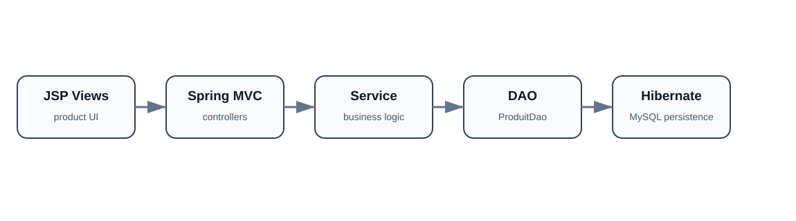

# Spring Hibernate Product Management

A Java web application for managing products with a classic layered architecture built with **Spring MVC**, **Hibernate ORM**, **JSP**, and **MySQL**.

## Architecture



The application follows a simple MVC/service/DAO separation:

- JSP pages render the product interface;
- `HomeController` handles web requests;
- `ProduitService` contains the service layer;
- `ProduitDao` manages persistence operations;
- Hibernate maps the `Produit` entity to MySQL.

## Technology stack

- Java 8
- Spring MVC 5.3
- Spring ORM
- Hibernate 5.6
- MySQL Connector/J
- JSP / JSTL
- Maven
- Java Servlet API

## Main project structure

```text
src/main/java/
├── controller/
│   └── HomeController.java
├── dao/
│   └── ProduitDao.java
├── model/
│   └── Produit.java
└── service/
    └── ProduitService.java

src/main/resources/
└── hibernate.cfg.xml

src/main/webapp/
├── Pages/
│   ├── index.jsp
│   └── produits.jsp
└── WEB-INF/
    ├── application-servlet-config.xml
    └── web.xml
```

## Application flow

```text
Browser
  -> JSP view
  -> Spring MVC controller
  -> service layer
  -> DAO
  -> Hibernate
  -> MySQL
```

## Build

The project is packaged as a WAR file.

```bash
mvn clean package
```

The generated application archive is created under `target/`.

## Configuration

Database persistence is configured in:

```text
src/main/resources/hibernate.cfg.xml
```

Before running the project, configure the local MySQL connection values for your own environment. Do not commit real database passwords or production credentials.

## Learning objectives

This project demonstrates:

- layered Java web architecture;
- Spring MVC request handling;
- service and DAO separation;
- Hibernate object-relational mapping;
- JSP-based server-side views;
- Maven dependency and WAR packaging.

## Academic context

The repository also contains the original `TP6_j2EE.pdf` assignment document. The application is kept as an educational J2EE/Spring/Hibernate project and should be evaluated in that context rather than as a modern production Spring Boot system.

## Author

Maintained by **Chaima Menouar** as part of her software-engineering portfolio.
